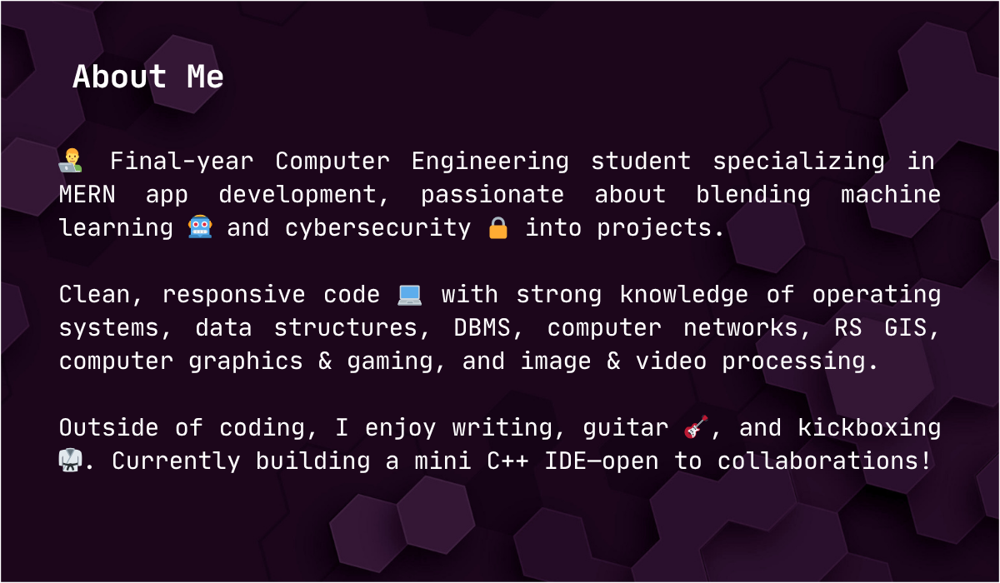
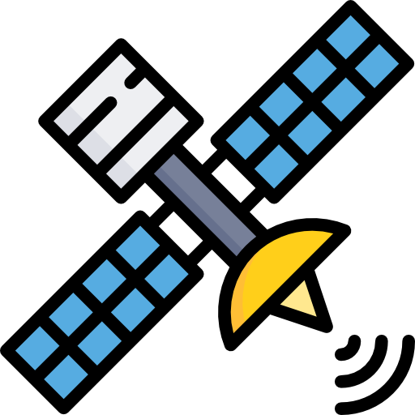

  
  
 

  
  
  
  
  
  
  
  

  
  
  

  
  
  
  
  
  
  
  
  
  

 

<h2 align="center">🚀 Some Featured Projects 🗿</h2>

<table align="center">
  <thead>
    <tr>
      <th>Icon</th>
      <th>Project Name</th>
      <th>Description</th>
      <th>Live Demo</th>
      <th>GitHub Repo</th>
    </tr>
  </thead>
  <tbody>
    <tr>
      <td align="center">
        
      </td>
      <td><strong>CloudCannon</strong> Minimalist cloud storage</td>
      <td>Secure, sleek cloud storage app with React and Supabase backend.</td>
      <td><a href="https://cloudcannon.vercel.app" target="_blank">🌐 Launch</a></td>
      <td><a href="https://github.com/sumdiboii/cloudcannon" target="_blank">📦 Repo</a></td>
    </tr>
    <tr>
      <td align="center">
        
      </td>
      <td><strong>u</strong> Minimalist cloud storage</td>
      <td>Secure, sleek cloud storage app with React and Supabase backend.</td>
      <td><a href="https://cloudcannon.vercel.app" target="_blank">🌐 Launch</a></td>
      <td><a href="https://github.com/sumdiboii/cloudcannon" target="_blank">📦 Repo</a></td>
    </tr>
    <tr>
      <td align="center">
        
      </td>
      <td><strong>m</strong> MERN diary app</td>
      <td>Personal diary app to record, edit, and manage your daily stories.</td>
      <td><a href="https://dear-diary.vercel.app" target="_blank">📖 Try It</a></td>
      <td><a href="https://github.com/sumdiboii/dear-diary" target="_blank">📘 Repo</a></td>
    </tr>
    <tr>
      <td align="center">
        
      </td>
      <td><strong>e</strong> AI voice-call protector</td>
      <td>Realistic AI voice app that mimics phone calls for personal safety in taxis.</td>
      <td>🚧 Coming Soon</td>
      <td><a href="https://github.com/sumdiboii/safeher" target="_blank">🔧 Repo</a></td>
    </tr>
    <tr>
      <td align="center">
        
      </td>
      <td><strong>d</strong> Minimalist cloud storage</td>
      <td>Secure, sleek cloud storage app with React and Supabase backend.</td>
      <td><a href="https://cloudcannon.vercel.app" target="_blank">🌐 Launch</a></td>
      <td><a href="https://github.com/sumdiboii/cloudcannon" target="_blank">📦 Repo</a></td>
    </tr>
    <tr>
      <td align="center">
        
      </td>
      <td><strong>h</strong> Minimalist cloud storage</td>
      <td>Secure, sleek cloud storage app with React and Supabase backend.</td>
      <td><a href="https://cloudcannon.vercel.app" target="_blank">🌐 Launch</a></td>
      <td><a href="https://github.com/sumdiboii/cloudcannon" target="_blank">📦 Repo</a></td>
    </tr>
    <tr>
      <td align="center">
        
      </td>
      <td><strong>p</strong> Minimalist cloud storage</td>
      <td>Secure, sleek cloud storage app with React and Supabase backend.</td>
      <td><a href="https://cloudcannon.vercel.app" target="_blank">🌐 Launch</a></td>
      <td><a href="https://github.com/sumdiboii/cloudcannon" target="_blank">📦 Repo</a></td>
    </tr>
    <tr>
      <td align="center">
        
      </td>
      <td><strong>i</strong> Minimalist cloud storage</td>
      <td>Secure, sleek cloud storage app with React and Supabase backend.</td>
      <td><a href="https://cloudcannon.vercel.app" target="_blank">🌐 Launch</a></td>
      <td><a href="https://github.com/sumdiboii/cloudcannon" target="_blank">📦 Repo</a></td>
    </tr>
    <tr>
      <td align="center">
        
      </td>
      <td><strong>m</strong> Minimalist cloud storage</td>
      <td>Secure, sleek cloud storage app with React and Supabase backend.</td>
      <td><a href="https://cloudcannon.vercel.app" target="_blank">🌐 Launch</a></td>
      <td><a href="https://github.com/sumdiboii/cloudcannon" target="_blank">📦 Repo</a></td>
    </tr>
  </tbody>
</table>

 

   &nbsp;&nbsp;&nbsp;
  

 

<!-- TITLE with Animated Typing Effect -->

  

  

 

  
  

  
  
  
  
  

   
   

