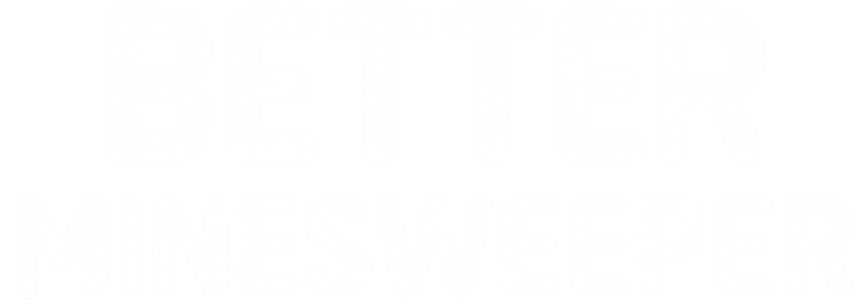
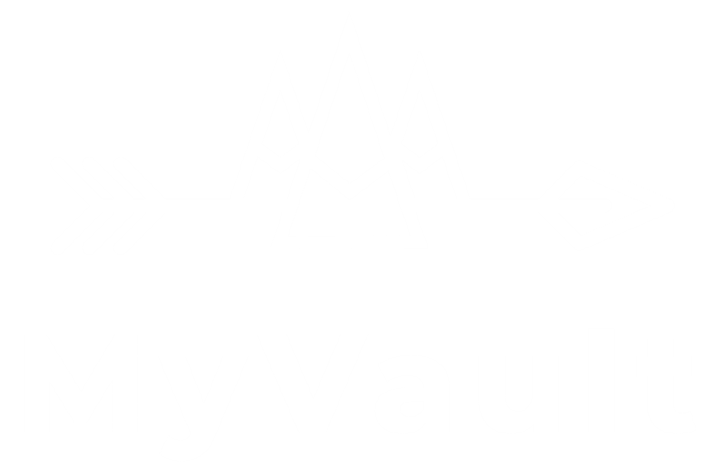
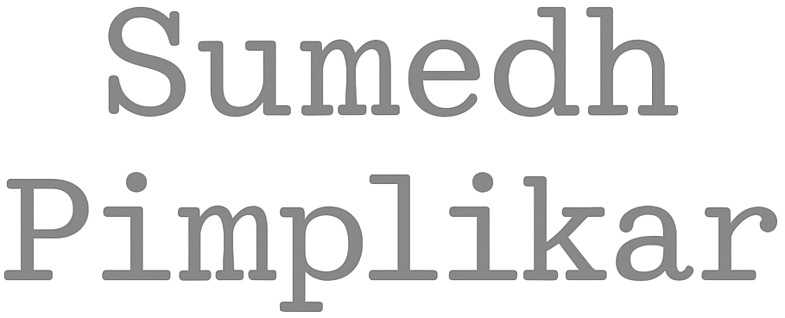
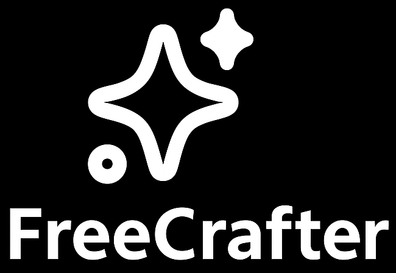
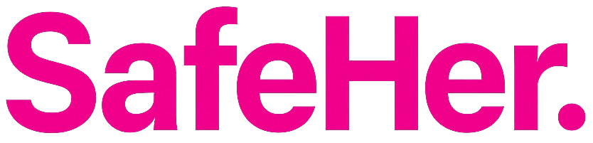
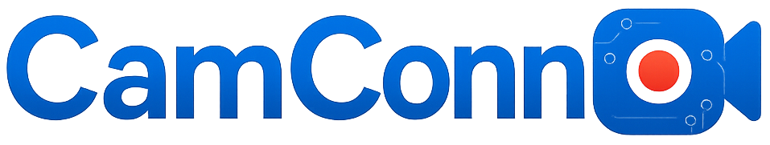
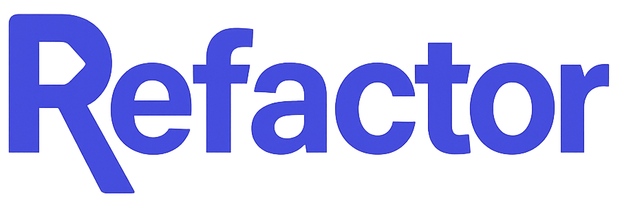

  
  
  
 
  

 

 

<table align="center">
  <thead>
    <tr>
      <th>Project Name</th>
      <th>Description</th>
      <th>Live Demo</th>
      <th>GitHub Repo</th>
    </tr>
  </thead>
  <tbody>
    <tr>
     <td align="center">
        
      </td>
      <td width="500">
        

           
          CloudCannon is a sleek, minimalist cloud storage app built with React, CSS, Supabase, and Vite. Enjoy secure two-step verification, easy file upload, rename, download (including ZIP), and sharing. Laboratory Mode lets you compress, enhance, and edit images or text files—always as safe copies. Clean, responsive UI. Pro-level features.  
      

      </td>
      <td>
<a href="https://cloud-cannon-space-app.vercel.app/" target="_blank">VIEW</a>
</td>
     <td>
<a href="https://github.com/Sumdiboii/cloud-cannon-space-app-public" target="_blank">REPOSITORY</a>
</td>
    </tr>
    <tr>
     <td align="center">
        
      </td>
      <td width="500">
        

           A React-based Pokédex featuring a library of 120 Pokémon with 3D Blender models, fluid animations, and a creative, responsive UI. Includes gym data, voice and audio integration, and Pokémon detection using a TensorFlow CNN with 96% accuracy. Combines real-time PokéAPI data with locally stored JSON for enhanced performance and custom content.  
      

      </td>
       <td>
<a href="https://pokedex-gamma-two.vercel.app/" target="_blank">VIEW</a>
</td>
     <td>
<a href="https://github.com/Sumdiboii/PokeDex-Project" target="_blank">REPOSITORY</a>
</td>
    </tr>
    <tr>
     <td align="center">
        
      </td>
      <td width="500">
        

           
          A fully responsive, interactive Minesweeper app built with React, Node.js, Express, and MongoDB. Features multiple game modes, customizable flags, in-game music, achievements, and seamless game data storage for a smooth user experience. Sleek UI and animations make it great for casual and competitive players. Multiplayer coming soon !!🗿  
      

      </td>
       <td>
<a href="https://better-minesweeper-react.vercel.app/" target="_blank">VIEW</a>
</td>
     <td>
<a href="https://github.com/Sumdiboii/better-minesweeper-react-public" target="_blank">REPOSITORY</a>
</td>
    </tr>
    <tr>
      <td align="center">
        
      </td>
     <td width="500">
        

           
         A React + Supabase password manager focused on security: client-side AES encryption, user-specific PIN and 2FA gating, phishing detection, Row Level Security, lockout after failed attempts, and strict backend CORS—demonstrating modern, layered cybersecurity techniques for safe password storage and management. ( supabase backend currently paused to accomodate another project )  
      

      </td>
      <td>
<a href="https://password-manager-cybersecurity.vercel.app/" target="_blank">VIEW</a>
</td>
     <td>
<a href="https://github.com/Sumdiboii/password-manager-cybersecurity-public" target="_blank">REPOSITORY</a>
</td>
    </tr>
    <tr>
     <td align="center">
        
      </td>
      <td width="500">
        
 
           
          A handcrafted portfolio built with React and vanilla CSS to express not just my skills but my soul. Every section, color, animation, and transition feels personal — telling my story like code that speaks. Creative, clean, and full of heart, this site is my digital identity — crafted with love to reflect me, inspire others, and showcase my passion.  
      

      </td>
      <td>
<a href="https://portfolio-website-c16e.vercel.app/" target="_blank">VIEW</a>
</td>
     <td>
<a href="https://github.com/Sumdiboii/portfolio-website-project" target="_blank">REPOSITORY</a>
</td>
    </tr>
    <tr>
     <td align="center">
        
      </td>
      <td width="500">
        

           
PillowTalk is a secure, full-stack digital diary, meticulously crafted with the MERN stack. It offers a private space for your thoughts, leveraging sentiment analysis based on moods for tailored prompts. With robust 2-step verification, your entries are kept exceptionally private. It's a powerfully personal tool, helping you grow with each entry!  
      

      </td>
       <td>
<a href="https://pillowtalk-dear-diary-web-app-git-se-08ba82-sumdiboiis-projects.vercel.app/" target="_blank">VIEW</a>
</td>
     <td>
<a href="https://github.com/Sumdiboii/pillowtalk-dear-diary-web-app-public" target="_blank">REPOSITORY</a>
</td>
    </tr>
    <tr>
     <td align="center">
        
      </td>
      <td width="500">
        

           
          Built by a skilled team of six with React.js and CSS, this responsive website showcases event details, schedules, and media for Anantya Techfest 2025. MongoDB manages large file storage, ensuring smooth media delivery. The site is optimized for all devices, delivering an engaging, user-friendly experience embodying the techfest’s innovative spirit  
      

      </td>
       <td>
<a href="https://anantya-2-k25.vercel.app/" target="_blank">VIEW</a>
</td>
     <td>
<a href="https://github.com/Sumdiboii/Anantya-2k25-Techfest-website-public" target="_blank">REPOSITORY</a>
</td>
    </tr>
    <tr>
     <td align="center">
        
      </td>
      <td width="500">
        

           
          Satellite Image Compression is a web app that intelligently reduces the size of high-resolution satellite images using DCT and Huffman encoding, while preserving visual quality. It enables faster storage, smoother transmission, and efficient handling of large-scale geospatial data through simple, user-friendly compression tools.  
        

      </td>
       <td>
<a href="https://satellite-image-compression.streamlit.app/" target="_blank">VIEW</a>
</td>
     <td>
<a href="https://github.com/Sumdiboii/Satellite_Image_Compression_by_DCT_Huffman" target="_blank">REPOSITORY</a>
</td>
    </tr>
     <tr> 
     <td align="center">
        
      </td>
       <td width="500">
        

           
         Sponsored by Skillyug Education Academy, this platform helps students prepare for NMMS, SAT, and Math with interactive modules, adaptive assessments, and mini-games. Designed to support 50,000+ students at peak usage, with scalable performance for future growth.  
      

      </td>
       <td>
IN WORKS
</td>
     <td>
<a href="https://github.com/Sumdiboii/skillyug-exam-portal-btech-project-public" target="_blank">REPOSITORY</a>
</td>
    </tr>
    <tr>
      <td align="center">
        
      </td>
      <td width="500">
        

           
          About
FreeCrafter is a responsive web app for generating images with six free AI models, featuring real-time analytics and smart prompt suggestions. Developed for our Business Intelligence and Computer Vision course under Dr. Ganesh Kadam by a team of three.
            
        

      </td>
       <td>
<a href="https://advanced-diffusion-models-for-image.vercel.app/" target="_blank">VIEW</a>
</td>
     <td>
<a href="https://github.com/Sumdiboii/Advanced-Diffusion-Models-for-Image-Generation-public" target="_blank">REPOSITORY</a>
</td>
    </tr>
    <tr>
     <td align="center">
        
      </td>
      <td width="500">
        

           
         Full-stack FastAPI + React app to search, filter, and analyze papers from OpenAlex & Semantic Scholar. Features charts, bookmarks, CSV export, and advanced filters for streamlined academic research.  
        

      </td>
       <td>
<a href="https://web-crawler-openalex-semantic-resea.vercel.app/" target="_blank">VIEW</a>
</td>
     <td>
<a href="https://github.com/Sumdiboii/web-crawler-openalex-semantic-research-papers-public" target="_blank">REPOSITORY</a>
</td>
    </tr>
    <tr>
     <td align="center">
        
      </td>
      <td width="500">
        

           
          This full-stack web application was developed as a summer internship project and gifted to the Computer Engineering Department. It lists all real-time research papers published by every faculty member, using SerpAPI to fetch data from Google Scholar. Features include Excel download, bookmarks, dark mode, and a responsive user interface.  
        

      </td>
       <td>
<a href="https://serp-api-web-crawler-summer-interns.vercel.app/" target="_blank">VIEW</a>
</td>
     <td>
<a href="https://github.com/Sumdiboii/serp-api-web-crawler-summer-internship-pccoe-public" target="_blank">REPOSITORY</a>
</td>
    </tr>
    <tr>
     <td align="center">
        
      </td>
       <td width="500">
        

           
          SafeHer. is a simple, no-login mobile app that simulates realistic AI phone calls using 4 dynamic voices — designed to help users, especially women, feel safer during solo commutes. With just a Start button and voice switch, it offers quick protection through presence — built using React Native for speed and ease.  
      

      </td>
       <td>
IN WORKS
</td>
     <td>
<a href="https://github.com/Sumdiboii/safeher-security-app-AI-voice-public" target="_blank">REPOSITORY</a>
</td>
    </tr>
     <tr>
     <td align="center">
        
      </td>
       <td width="500">
        

           
          CamConnect is a WebRTC-based web app enabling anonymous one-on-one video calls with integrated real-time chat. It leverages Socket.IO for signaling and peer-to-peer media streaming, offering a seamless, low-latency communication experience without requiring user login.  
      

      </td>
       <td>
IN WORKS
</td>
     <td>
<a href="https://github.com/Sumdiboii/camconnect-video-calling-app-public" target="_blank">REPOSITORY</a>
</td>
    </tr>
     <tr> 
     <td align="center">
        
      </td>
       <td width="500">
        

           
          Refactor is a multi-language smart compiler supporting over 10 programming languages with seamless code execution, storage, and sharing. Its standout feature? Instantly generate a .txt file of your code and link it via a custom TinyURL — making your snippets accessible, shareable, and executable from anywhere.  
      

      </td>
       <td>
IN WORKS
</td>
     <td>
<a href="https://github.com/Sumdiboii/refactor-smart-compiler-public" target="_blank">REPOSITORY</a>
</td>
    </tr>
    </tr>
  </tbody>
</table>

 

  

 

  

 

<!-- TITLE with Animated Typing Effect -->

  

  

 

  

 

   
   
  

  
    

  
  
  
  
  

  
   

